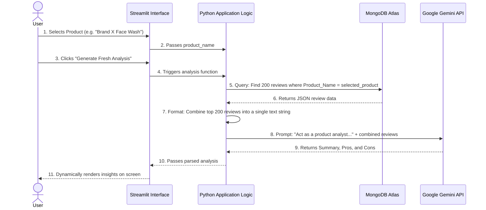

# System Architecture

## Level 2 Data Flow Diagram (DFD)

The following sequence diagram illustrates the Dynamic Mapping Mechanism, showing how the user's interaction triggers the database pull and model inference.

## Tech Stack Overview

1. **Frontend & Router**: `Streamlit` - Handles UI, dropdowns, and rerunning the Python logic.
2. **Database**: `MongoDB Atlas` - NoSQL cloud database storing unstructured review data.
3. **The Brain**: `Google Gemini` - LLM used to process up to 1 million tokens and generate fresh insights.
4. **Hosting**: `Streamlit Community Cloud` - Directly links to GitHub for deployment (Day 7).
